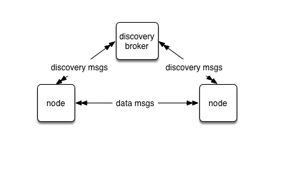

# Naming Service/Peer Discovery
The current implementation is geared heavily towards point-to-point TCP connections to connect nodes.[1](#footnote1)  With that comes the problem of how to provide addressing information to nodes so they can connect to their peers.

Some networking middlewares (e.g., Apache Qpid) avoid this problem by using a central broker process, where all nodes connect to the broker at a "well-known" address.  The broker is then responsible for routing messages between nodes based on which nodes have expressed interest in particular topics.

This design sacrifices performance for convenience, and additionally introduces a single point of failure in the network.  These are both unacceptable compromises for many use cases.  

However, with no central broker, a mechanism is needed to provide nodes with the configuration information to connect to their peers.  

OZ introduces a hybrid approach, which distinguishes between discovery (naming) messages and data messages.  

- "Naming" (i.e., discovery) messages are used to tell nodes how to connect to their peers, and are routed through one or more broker processes (or "proxy" in ZeroMQ terms).  These broker processes are configured at well-known addresses that each node uses to connect to them.
  - Each node has both a PUB and SUB socket that are connected to the broker ("naming" sockets).
- Data messages are sent directly between nodes, bypassing the broker.
  - Each node has both a PUB and SUB socket that are connected to all other peer nodes ("data" sockets).

That architecture is illustrated below:

|  | 
|:--:| 
| *Network Architecture* |

- Each node connects to a broker (zmq_proxy) process to publish and subscribe to discovery messages.

- Each node connects directly for data messages to any node for which it receives a discovery message.  
  - SUB sockets always connect to PUB sockets.  This eliminates the possiblity that two nodes will "cross-connect" in such a way as to cause duplicate messages.
  - This is also the preferred way to connect sockets in ZeroMQ (see <https://github.com/zeromq/libzmq/issues/2267>).  

- At startup, each node publishes its address information via the broker process:
  - The node binds its "data" PUB socket to an ephemeral port.  This endpoint is published in subsequent discovery messages sent by the node.
  - The node connects its "naming" SUB socket to the broker's PUB port.
  - When the node receives the welcome message from the broker:
     - It connects its "naming" PUB socket to the broker's SUB socket.  (The endpoint of the broker's SUB socket is contained in the welcome message).
     - It begins publishing its discovery information on the "naming" PUB socket. 
     - It continues to publish its address information until it receives its own message. This ensures that at least one broker has received and forwarded the message.

- When a node receives a discovery message for a peer which it has not already seen, it re-publishes its own address information.  This ensures that "late joiners" get all discovery messages.
- Subscription information is exchanged when the nodes connect.  (This is handled by the ZeroMQ layer).

- Filtering is done by ZeroMQ at the publisher, so a node will only receive messages which it has subscribed to.

This approach results in a "fully-connected" (mesh) network where every node is connected to every other node.[2](#footnote2) [3](#footnote3)  

This approach gives the best of both worlds:  the convenience of simple configuration using a central broker, along with the performance advantages of direct node-to-node communication.

## Using "naming" mode
Whether to use "naming" mode is determined from the mama.properties file -- if the `is_naming` attribute is set to 1, then naming mode is active, and the mama.properties file must also contain entries for the nsd server(s):

    mama.zmq.transport.<transport_name>.is_naming=1
    mama.zmq.transport.<transport_name>.naming.subscribe_address_0="endpoint"
    mama.zmq.transport.<transport_name>.naming.subscribe_port_0=port
    mama.zmq.transport.<transport_name>.naming.subscribe_address_n="endpoint"
    mama.zmq.transport.<transport_name>.naming.subscribe_port_n=port

If naming mode is not active, applications need to specify endpoint values for the pub/sub sockets in mama.properties:

    mama.zmq.transport.<transport_name>.outgoing_url_0="endpoint"
    mama.zmq.transport.<transport_name>.outgoing_url_1="endpoint"
    mama.zmq.transport.<transport_name>.outgoing_url_n="endpoint"
    mama.zmq.transport.<transport_name>.incoming_url_0="endpoint"
    mama.zmq.transport.<transport_name>.incoming_url_1="endpoint"
    mama.zmq.transport.<transport_name>.incoming_url_n="endpoint"

Obviously, this gets out of hand with more than a few nodes.  However, it is possible to set the incoming_url and outgoing_url values to the address of a `zmq_proxy` implementation (as described in the ["The-Dynamic-Discovery-Problem" section of the ZeroMQ Guide](http://zguide.zeromq.org/page:all#The-Dynamic-Discovery-Problem). Doing this creates a brokered network similar to the approach used by JMS, AMQP, etc.  The obvious disadvantage of this approach is that each message must take two "hops" to get to its destination.

Using naming mode affords the flexibility and simplicity of a brokered architecture, without the performance penalty caused by the additional network hop.

## Startup
It is possible to reliably determine whether a process is able to connect to at least one nsd/proxy, by listening for the naming messages that the process sends.  If a process receives at least one of its own naming messages, it knows that the message was received and forwarded by at least one nsd/proxy process.

This gives us the option to detect at startup if there is a problem with the nsd/proxy processes -- if there is, the library logs a message and returns an error to the application indicating that the transport is unable to start.
 
## Beaconing
Each node continually publishes its discovery message (i.e., "beaconing") at a regular interval.  That can be disabled by setting the following in `mama.properties`:

    mama.zmq.transport.<transport_name>.beacon_interval=0

The default beaconing interval is one second.

## Automatic reconnection
By default, automatic reconnection is enabled for the naming sockets, under control of the following settings in mama.properties:

    mama.zmq.transport.<transport_name>.naming.naming.retry_connects=1
    mama.zmq.transport.<transport_name>.naming.retry_interval=10

<a name="footnote1">1</a>: Typically a node is a Linux process, which in turn represents a single OpenMAMA transport bridge library.

<a name="footnote2">2</a>: It is certainly possible to sub-divide the network by introducing the concept of named "domains" or "groups".   

<a name="footnote3">3</a>: The number of individual connections for a mesh network is n^2/2, so for a network with 100 nodes there are 5,000 total connections.  This assumes that every node has n connections -- one for each node, including itself.
