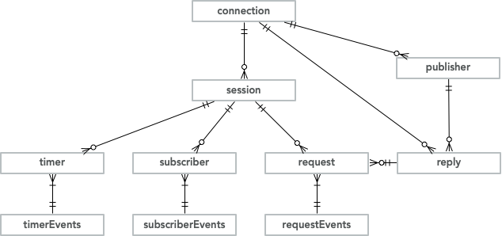

# OZ Examples

## Example programs

These are stripped-down versions of the examples included with OpenMAMA -- while they don't support options in the same way as the OpenMAMA examples, their relative brevity (around 10% of the size of the OpenMAMA examples), and their use of modern C++ constructs, should make the examples easier to use and understand.

The examples use the classes described below and implemented in the `ozimpl.h`/`ozimpl.cpp`files.

Program | Description
----- | -------------
pub.cpp | Publisher example.
sub.cpp | Subscriber example.  Demonstrates using an "events" class to process asynchronous callbacks.
req.cpp | Request/reply example, which also demonstrates manual lifetime management of objects.
rep.cpp | Sample progam to reply to requests, using `reply` class to wrap the original request.
req2.cpp | Request/reply example demonstrating how to wait for a synchronous reply, and how to multiply inherit from both `request` and `requestEvents` classes.
timer.cpp | Timer sample demonstrating manual lifetime management.
timer2.cpp | Similar to timer.cpp, but using automatic lifetime management (RAII).


## OZ API
The `oz` namespace defines several classes designed to provide a simple, easy-to-use introduction to OpenMAMA and OZ.

Class | Description
----- | -------------
connection | Encapsulates both the transport and payload bridge libraries.
session | Encapsulates a callback thread, and is implemented using mamaQueue and mamaDispatcher.
publisher | Thin wrapper over mamaPublisher
subscriber | Thin wrapper over mamaSubscription.  Supports only basic (not market-data) subscriptions.
subscriberEvents | Declares callback functions for subscription events.
timer | Encapsulates a mamaTimer object.
timerEvents | Declares callback functions for timer events.
request | Represents a mamaInbox, along with callback functions for 
requestEvents | Declares callback functions for request events, i.e. replies directed to the request's underlying `mamaInbox`.
reply | The reply class simplifies sending responses to inbox requests.

The classes' relationships are illustrated below:<br>



## Asynchronous callback events

Classes that generate asynchronous callbacks are associated with a session object, which provides the queue/dispatcher/thread on which the callbacks are invoked.  These classes also have an associated "xxxEvents" class that defines the callback methods for the appropriate source.  Applications can choose whether to define the events class separately, or to multiply-inherit from both the source and sink events.  (See the `req2.cpp` sample for an example of the latter approach).

The destructor for event sources is declared `protected` in order to prevent it being called from application code -- instead these classes define a `destroy` method that calls the appropriate MAMA function to tear down the event source.  The MAMA code enqueues the destroy on the object's queue -- when the object is eventually destroyed MAMA calls an `onDestroy` callback, which OZ then uses to do the final `delete this`.


## Compiler support
The `oz` classes target C++11 -- this allows the code to be cleaner and more readable, compared to the older C++98 standard used by OpenMAMA's native C++ support.  (We currently don't use features specific to C++14 and above in order to work with as wide a range of compilers as possible).

## Smart pointers/RAII
In keeping with the recommendations in [EMC++](https://www.aristeia.com/EMC++.html) and the [C++ Core Guidelines](https://isocpp.github.io/CppCoreGuidelines/CppCoreGuidelines), the factory functions in OZ return `unique_ptr`'s.  These have no space or speed penalties relative to raw pointers, and can be easily converted to `shared_ptr`'s if desired.

In addition, each class has a custom deleter defined that respects the OZ convention of destroying objects by calling their `destroy` methods, rather than their destructors.

Since the smart pointer `deleter`'s are invoked in reverse order of their creation, this ensures a clean tear-down of the MAMA objects.

If an application prefers to manage object lifetimes itself, it can call the `unique_ptr::release` method to acquire a raw pointer, which it is then responsible for.  (See the `req.cpp` program for an example of this).  

Note that if you choose to manage object lifetimes manually, you should make sure to do so as documented in the [Developer Guide](http://www.openmama.org/sites/default/files/OpenMAMA%20Developer%27s%20Guide%20C.pdf>).


## Messages
Conspicuous perhaps by its absence is a wrapper class for `mamaMsg`.  The main reason for this is the sheer number of methods that would be required -- another reason is that the `mamaMsg` API is actually relatively easy to understand and use, compared to some of the other MAMA APIs.

This may come at some point, but is currently not a priority.

## Publishers
The connection classes maintains a collection of publishers, keyed by topic.  This is a potential performance optimization, since publishers can be shared among all threads that need to publish messages.

Where this really comes into play is when publising replies to inboxes -- since a single topic (publisher) is used for all inbox replies, there is no need to create a publisher for each inbox.

The publishers are reference-counted and deleted when no longer used.


## Macros
The OZ header defines two macros that can be helpful, `CALL_MAMA_FUNC` and `TRY_MAMA_FUNC`.  

`CALL_MAMA_FUNC` calls a MAMA function -- if the called function returns anything other than `MAMA_STATUS_OK`, it logs a message before returning the mama_status.

`TRY_MAMA_FUNC` calls a MAMA function -- if the MAMA function returns anything other than `MAMA_STATUS_OK`, it logs a message and throws the mama_status.

The OZ library code uses `CALL_MAMA_FUNC` exclusively, while the sample programs use `TRY_MAMA_FUNC` to ensure that any errors cannot be ignored.

When using `TRY_MAMA_FUNC`, any errors will be displayed similar to:

```
8/12 10:28:54.776905|mama_loadBridgeWithPathInternal|31394-7f79dabdb7c0|ERR(0,0) mama_loadmamaPayload(): Could not open middleware bridge library [mamaxxximpl] [libmamaxxximpl.so: cannot open shared object file: No such file or directory]|mama.c(2662)
8/12 10:28:54.776988|start|31394-7f79dabdb7c0|ERR(0,0) Error 26(NO_BRIDGE_IMPL)|ozimpl.cpp(18)
8/12 10:28:54.777001|main|31394-7f79dabdb7c0|ERR(0,0) Error 26(NO_BRIDGE_IMPL)|pub.cpp(22)
terminate called after throwing an instance of 'mama_status'
Aborted (core dumped)
```

## Naming Conventions

The OZ classes use camelCase for pretty much everything, except macros which use ALL_CAPS_WITH_UNDERSCORES.

A 'p' prefix is used for raw pointers -- e.g., `subscriber* pSubscriber`.  That is the only time type information is encoded in a name.

Class member variables are named with a trailing underscore, e.g., `conn_`.


